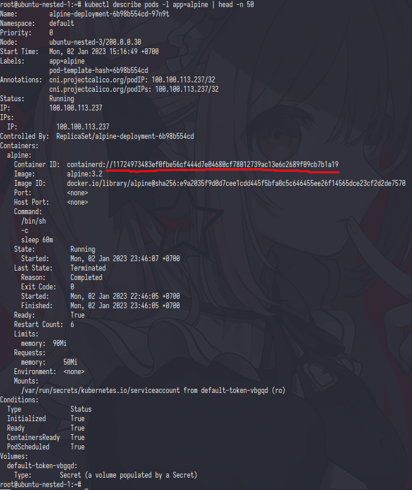
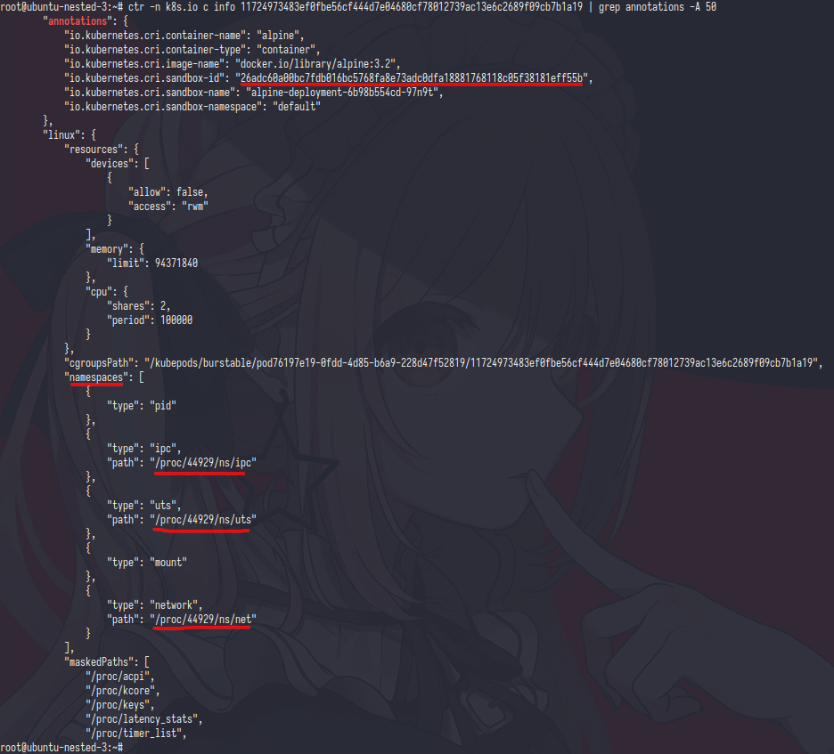
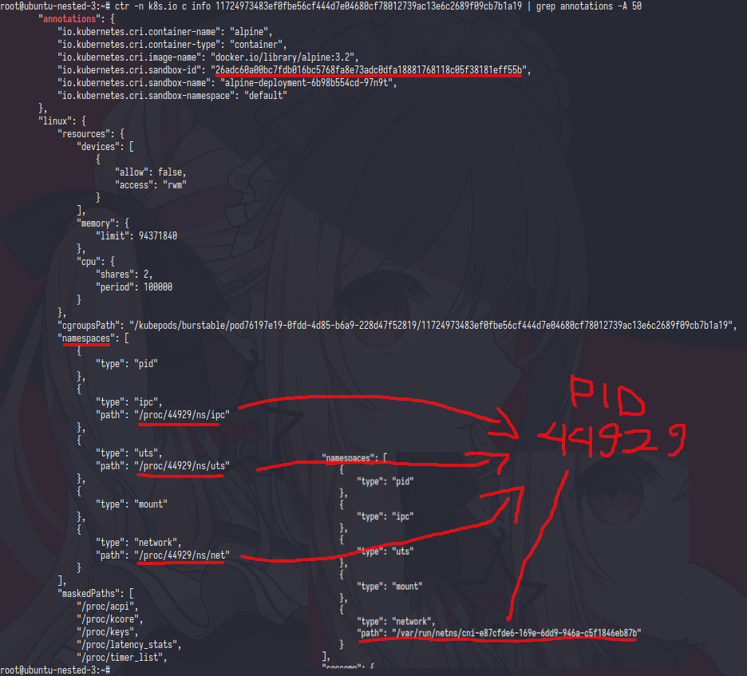
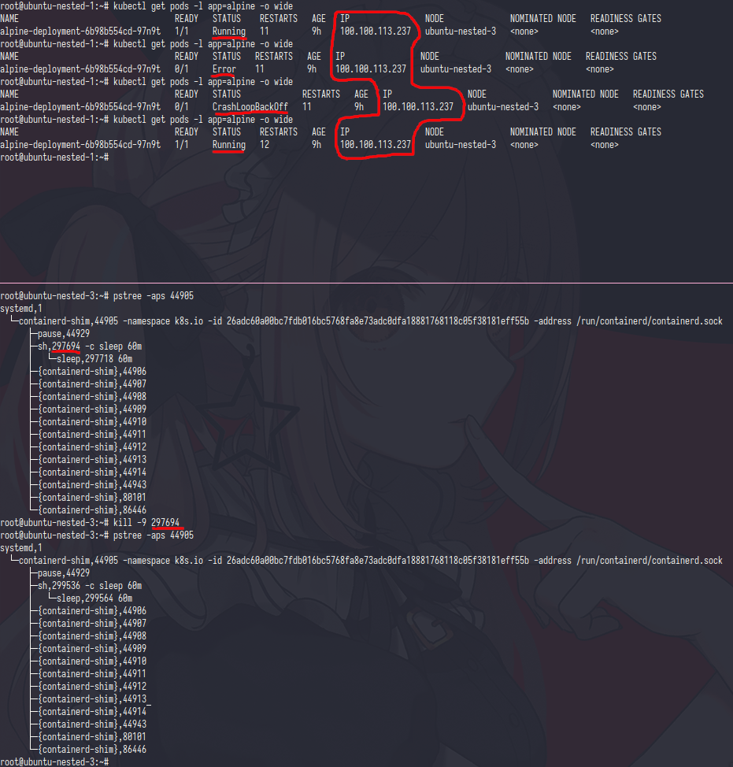
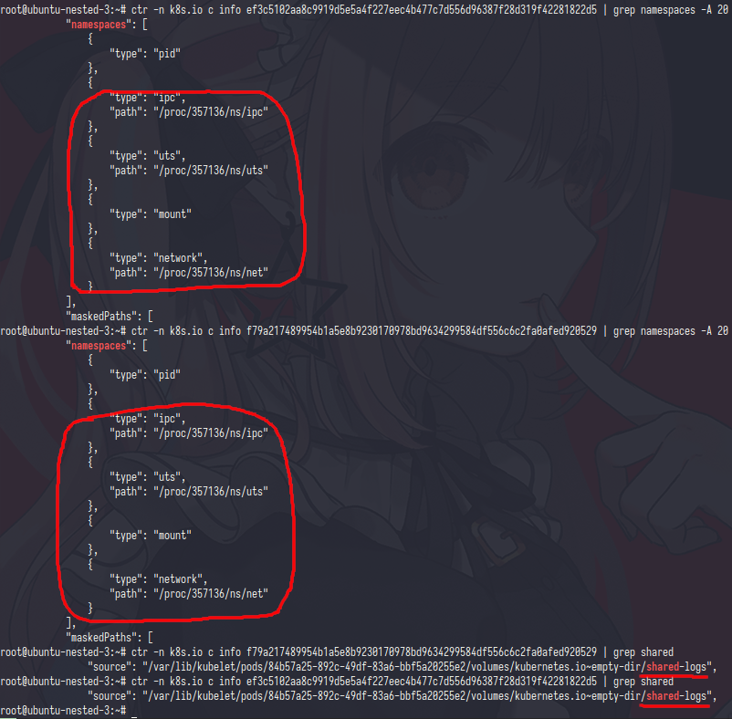

In my previous i tank about **container** now time to level up,yep from this post i will talk about kubernetes or k8s but the perfective still same with the title i will talk on low level of kubernetes, so if you come here to learning about istio,service mash,cicd or another mumbo jumbo i think you on worng train mate

## Pause
Before you learn how to deploy or doing scaling up/down did you know about pause in kubernetes? if you experiance with minikube or your container runtime is docker i'm pretty sure if you already this container but i'm pretty sure also if you don't event know what the hell is pause 

just like usually, let's read the official docs about pause container  
.........  
i can't find it ._. (of i just miss it?)  

i don't know why kubernetes not write about pause container, but let's try to find out on ~~chatGPT~~ google.

gladly i'm found some blog from [Ian Matthew Lewis](https://www.ianlewis.org/en/almighty-pause-container) who write about pause container  


In that article says if pause container was a **parrent container** and have two resposibilities, one is linux namespaces sharing and another one is server as PID 1 for pods

What the meaning of that?  
Well if you already read my previous post and trying to create container manualy i think you should have better imagination about this, or even you already know what the point of pause container. but sure some of you was speed runner who just want the answer from post whitout doing the boring experiment

in my previous post i'm alredy explain to you all about **container** aka fancy namespaces, remember if container is namespaces and every namespaces have own id right? and if the namespaces id was same they will sharing resource right?   

now imagine if i create container A also i'm setup the network,after that i create the container B buttttt **i also attach the network namespace from container A to B** so container A and B will have same network namespaces  

from that scenario what will happen?  
right,container A and container B will have same ip add,mac,etc. ok save it the teory for now,time to do experiment


```bash
cat <<EOF | kubectl apply -f -
apiVersion: apps/v1
kind: Deployment
metadata:
  name: alpine-deployment
spec:
  selector:
    matchLabels:
      app: alpine
  replicas: 1
  template:
    metadata:
      labels:
        app: alpine
    spec:
      containers:
      - image: alpine:3.2
        command:
          - /bin/sh
          - "-c"
          - "sleep 60m"
        imagePullPolicy: IfNotPresent
        name: alpine
        resources:
          requests:
            memory: 50Mi
          limits:
            memory: 100Mi
      nodeSelector:
        kubernetes.io/hostname: "ubuntu-nested-3"
      restartPolicy: Always
EOF
```
let create the pods


now the pods was running,let's take a look into container id  



if i describe the pods kubernetes only tell you the container is one but let's have check into ubuntu-nested-3


ok i'm found the container,let's check in details



from this pic i think/should you already get the point of pause container or not? but sure let me explain 

first,the sandbox-id is have uniq uid it's like container id let's check it


and bingooo,that was pause container


the diffrent only in network namespaces,let's check via ip netns


the output was pid 44929 which is that pid was attached in alpine container



here was the summary of pause container

pause container will create namespace then the real container aka alpine will attach the namespaces who already created by pause container

if you ask why kubernetes do this?

the simple answer is  
```
if something happen with the 'real' container (ie: crash,exit non zero,etc) the 'real' container will not lose the ip address and that make the cni will not fucked up when many pods are restarting in same time
```

### Another way


you can search the process by using pause container id and pstree it 

as you can see the containerd runtime use pause container id as primary container not the alpine container 

### PoC


so in here i was trying to kill alpine container and the kubernetes will recreate the alpine container but because alpine container was only attaching pause namespaces that make the ip address of container was persistent

## Multiple container at one pod(sidecar)
In theory you can have multiple container on 1 pods


And same like the pause container,the resource was shared between container


```bash
cat <<EOF | kubectl apply -f -
apiVersion: v1
kind: ConfigMap
metadata:
  name: nginx-index
data:
  index.html: "<html><head><title>Kano</title></head><body>Kano/鹿乃</body></html>"

---
apiVersion: apps/v1
kind: Deployment
metadata:
  name: nginx-deployment
spec:
  selector:
    matchLabels:
      app: nginx
  replicas: 1
  template:
    metadata:
      labels:
        app: nginx
    spec:
      volumes:
        - name: shared-logs
          emptyDir: {}
        - name: nginx-index-cm
          configMap:
            name: nginx-index
      containers:
      - name: nginx
        image: nginx:latest
        ports:
        - containerPort: 80
        volumeMounts:
          - name: shared-logs
            mountPath: /var/log/nginx
          - name: nginx-index-cm
            mountPath: /usr/share/nginx/html/
        resources:
          requests:
            memory: 50Mi
          limits:
            memory: 100Mi

      - name: nginx-sidecar-container
        image: busybox
        command: ["sh","-c","while true; do cat /var/log/nginx/access.log; sleep 30; done"]
        volumeMounts:
          - name: shared-logs
            mountPath: /var/log/nginx
            readOnly: true

      nodeSelector:
        kubernetes.io/hostname: "ubuntu-nested-3"
      restartPolicy: Always
---
apiVersion: v1
kind: Service
metadata:
  name: nginx-deployment
  namespace: default
  labels:
    app: nginx
spec:
  ports:
  - name: http
    port: 80
    protocol: TCP
    targetPort: 80
  selector:
    app: nginx
  type: LoadBalancer
EOF
```

create nginx container with logging sidecar


for example if you create multiple container the ready status will same like your container 


the containers ID have two diffrent id



from namespace they have same pid and same mount point 


## Resources
TODO