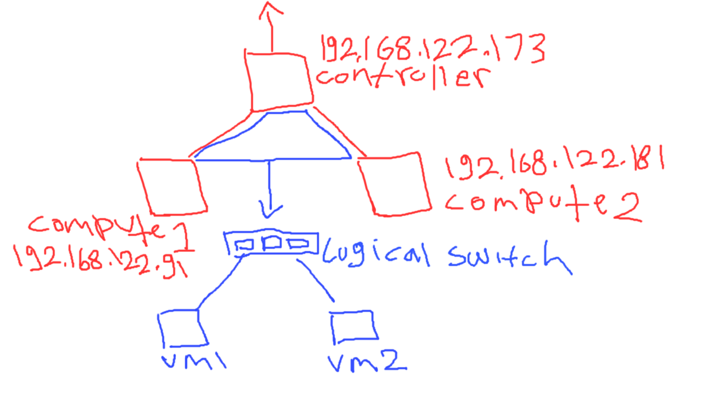

OVN or Open Virtual Network is one of openswitch project.

OVN it self was a framework of OpenvSwitch, if you ever playing with openvswitch or manage openstack cluster with dvr you should know if every openvswitch have thier agent (ie. neutron-agent) to config the openvswitch on that host. now just image if the agent it's self was ovs so we don't need write our agent from strach for manage/orcrastion openvswitch cluster, for more detail you can read the [OVN arch](https://www.ovn.org/en/architecture/).

before we start playing about OVN better if we create a simple network topology.

## Topology
- 1 Controller as a gateway
- 1 Logical switch
- 2 Compute 
- 2 client



red : physical network  
blue : overlay network

- Controller : 192.168.122.173
- Compute 1 : 192.168.122.91
- Compute 2 : 192.168.122.181

from this topology my goal is to connection vm1 to vm2, ofcourse that vm will hosted in diffrent host (vm1 on compute 1 and vm2 on compute 2)

## Setup

All nodes
```bash
sudo add-apt-repository cloud-archive:ussuri
sudo apt install -y openvswitch-common openvswitch-switch ovn-common ovn-host
```

On controller only
```bash
sudo apt install -y ovn-central
sudo ovn-sbctl set-connection ptcp:6642
sudo ovn-nbctl set-connection ptcp:6641
sudo netstat -lntp | grep 664
```

Set openvswitch table,fill `ovn-remote` and `ovn-nb` parameter with controller ip, meanwhile the `ovn-encap-ip` with host ip

```bash
ovs-vsctl set open_vswitch . external_ids:ovn-remote="tcp:192.168.122.173:6642" external_ids:ovn-nb="tcp:192.168.122.173:6641" external_ids:ovn-encap-ip=192.168.122.173 external_ids:ovn-encap-type="geneve" external_ids:system-id="host1"
```

On compute
```bash
ovs-vsctl set open_vswitch . external_ids:ovn-remote="tcp:192.168.122.173:6642" external_ids:ovn-nb="tcp:192.168.122.173:6641" external_ids:ovn-encap-ip=$(COMPUTE_IP) external_ids:ovn-encap-type="geneve" external_ids:system-id="$(COMPUTE_NUMBER)"
```

if all already executed we can verify all config by `ovn-sbctl show`

```bash
root@ubuntu-nested-1:~# ovn-sbctl show
Chassis host1
    hostname: ubuntu-nested-1
    Encap geneve
        ip: "192.168.122.173"
        options: {csum="true"}
Chassis host3
    hostname: ubuntu-nested-3
    Encap geneve
        ip: "192.168.122.181"
        options: {csum="true"}
Chassis host2
    hostname: ubuntu-nested-2
    Encap geneve
        ip: "192.168.122.91"
        options: {csum="true"}
root@ubuntu-nested-1:~#
```
the Chassis value will taken from `system-id` when i'm set the ovs table.

## Create logical switch
```bash
ovn-nbctl ls-add net-1
ovn-nbctl set logical_switch net-1 other_config:subnet="10.0.0.0/24" other_config:exclude_ips="10.0.0.1"
```
Creating logical which with `ovn-nbctl ls-add net-1` (ls-add mean logical-switch add) and the switch name is net-1,we can verify with `ovn-sbctl ls-list` and Give some cidr and exclude_ip config for net-1 switch.

```bash
ovn-nbctl lsp-add net-1 vm1
ovn-nbctl lsp-set-addresses vm1 "00:00:00:00:01:01 10.0.0.10"

ovn-nbctl lsp-add net-1 vm2
ovn-nbctl lsp-set-addresses vm2 "00:00:00:00:01:02 10.0.0.20"
```
Create a virtual port & Set mac and ip address for vm1&2 port


you can verify with `ovn-nbctl lsp-list net-1`

## Create the client
In compute 1 i'm will set vm1 and vm2 on compute 2.

Compute 1 
```bash
ip link add vm1-peer type veth peer name vm1
ovs-vsctl add-port br-int vm1-peer
ovs-vsctl set interface vm1-peer external_ids:iface-id=vm1
ip link set vm1-peer up
ip netns add vm1-ns
ip link set vm1 netns vm1-ns
ip netns exec vm1-ns ip link set dev vm1 address 00:00:00:00:01:01
ip netns exec vm1-ns ip link set vm1 up
ip netns exec vm1-ns ip add add 10.0.0.10/24 dev vm1
ip netns exec vm1-ns ip a
```
Make sure the mac address was same

Compute 2
```bash
ip link add vm2-peer type veth peer name vm2
ovs-vsctl add-port br-int vm2-peer
ovs-vsctl set interface vm2-peer external_ids:iface-id=vm2
ip link set vm2-peer up
ip netns add vm2-ns
ip link set vm2 netns vm2-ns
ip netns exec vm2-ns ip link set dev vm2 address 00:00:00:00:01:02
ip netns exec vm2-ns ip link set vm2 up
ip netns exec vm2-ns ip add add 10.0.0.20/24 dev vm2
ip netns exec vm2-ns ip a
```

## Test
On compute 1
```bash
root@ubuntu-nested-2:~# ip netns exec vm1-ns ping -c 3 10.0.0.20
PING 10.0.0.20 (10.0.0.20) 56(84) bytes of data.
64 bytes from 10.0.0.20: icmp_seq=1 ttl=64 time=0.378 ms
64 bytes from 10.0.0.20: icmp_seq=2 ttl=64 time=0.353 ms
64 bytes from 10.0.0.20: icmp_seq=3 ttl=64 time=0.329 ms

--- 10.0.0.20 ping statistics ---
3 packets transmitted, 3 received, 0% packet loss, time 2038ms
rtt min/avg/max/mdev = 0.329/0.353/0.378/0.025 ms
root@ubuntu-nested-2:~#
```

On compute 2
```bash
root@ubuntu-nested-3:~# ip netns exec vm2-ns ping -c 3 10.0.0.10
PING 10.0.0.10 (10.0.0.10) 56(84) bytes of data.
64 bytes from 10.0.0.10: icmp_seq=1 ttl=64 time=0.444 ms
64 bytes from 10.0.0.10: icmp_seq=2 ttl=64 time=0.326 ms
64 bytes from 10.0.0.10: icmp_seq=3 ttl=64 time=0.307 ms

--- 10.0.0.10 ping statistics ---
3 packets transmitted, 3 received, 0% packet loss, time 2038ms
rtt min/avg/max/mdev = 0.307/0.359/0.444/0.060 ms
```

Now all client can ping each other even the client was hosted in different host/compute.


But wait,if you exec `ovn-sbctl show` the output will change can you see what is the change?

for now let end in here,in next post i will try to add router and snat&dnat(floating ip).